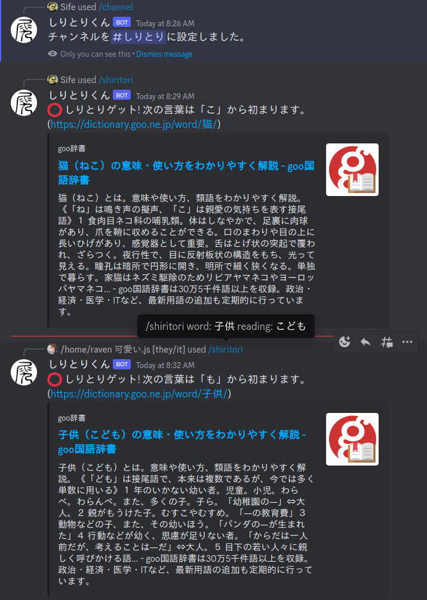

<h1 align="center">
  
   
  しりとりくん
   
</h1>

<!-- 

  
  
  

 -->

## Screenshot

  

## What it is

It's shiritori for Discord.

## How to use

Invite しりとりくん to your server (link). Use the `/channel` command in a channel that you wish to use for playing. Use the `/shiritori` command to add words. Use `/language` to change the language (default is Japanese because shiritori is a Japanese game and playing Japanese games in English is cringe).

## How it works

しりとりくん implements a minimal webscraper for goo辞書 to look up words submitted by users. Only the hash of a user's Discord ID is stored in our database for the purpose of game mechanics.

## Planned features

- Global server ranking/leaderboard (opt-in)
