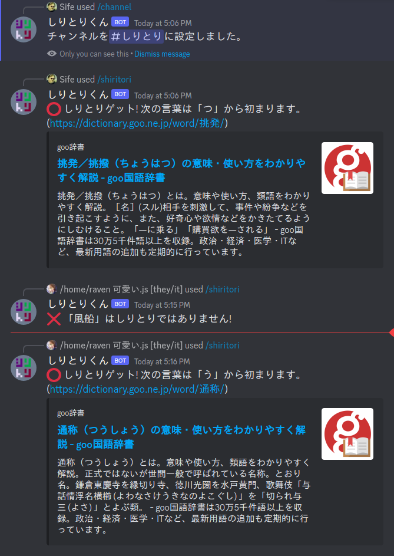

<h1 align="center">
  
   
  しりとりくん
   
</h1>

<!-- 

  
  
  

 -->

## Screenshot

  

## What it is

Educational bot/game for Discord based on [shiritori](https://ja.wikipedia.org/wiki/%E3%81%97%E3%82%8A%E3%81%A8%E3%82%8A). Compete with other servers to get the longest shiritori.

## How to use

[Invite](https://discord.com/api/oauth2/authorize?client_id=1083706973813477448&permissions=2147502080&scope=bot%20applications.commands) しりとりくん to your server. Use the `/channel` command in a channel that you wish to use for playing. Use the `/shiritori` command to add words.

**Commands:**
- administrator
  - `/channel` sets the channel for game
  - `/language` change game language (default: Japanese)
  - `/leaderboard` change leaderboard opt-in status (default: False)
- everyone
  - `/info` show game info and [leaderboard](https://d3pridv36h9c59.cloudfront.net/) link
  - `/shiritori word [reading]` add a word
    - `word` should be kanji if possible (kana works but less reliable)
    - `reading` is not necessary except to disambiguate words that have the same kanji but different reading

## How it works

しりとりくん implements a minimal webscraper for [goo辞書](https://dictionary.goo.ne.jp/) to look up words submitted by users. It doesn't collect or save any user info! Only the [hash](https://en.wikipedia.org/wiki/Hash_function) of a user's Discord ID is stored in the database for the purpose of game mechanics.

## Planned

- Home page and CSS improvements
